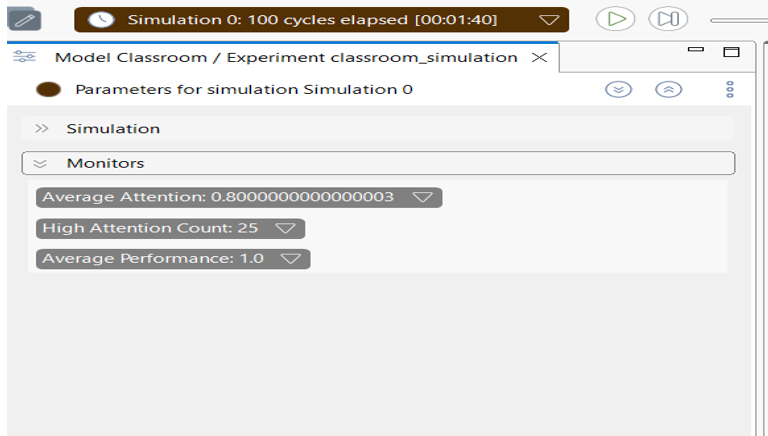
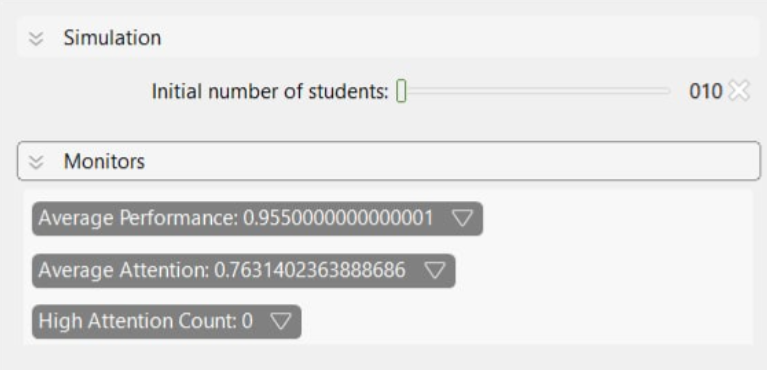
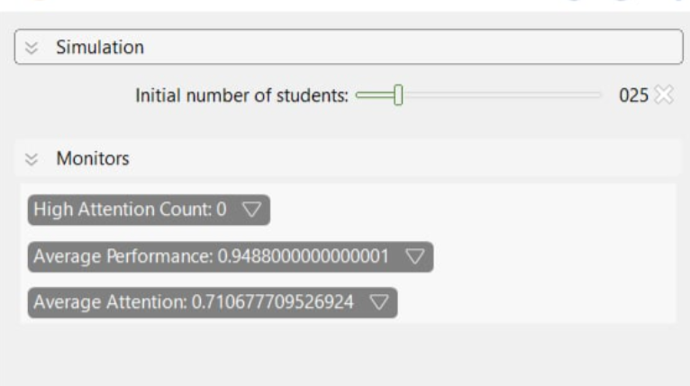
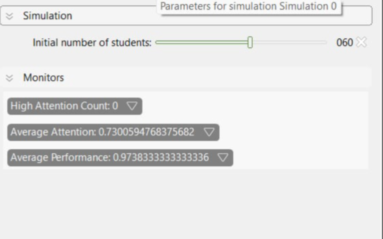
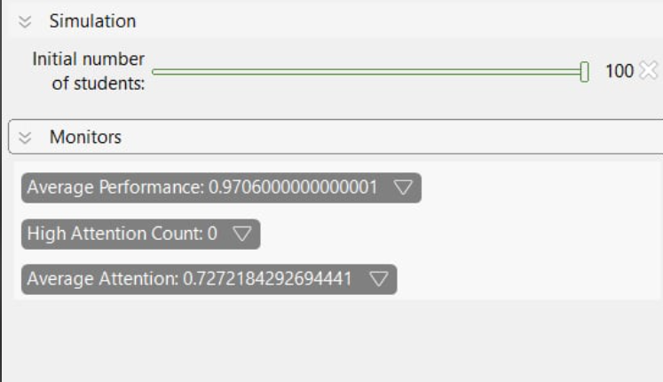
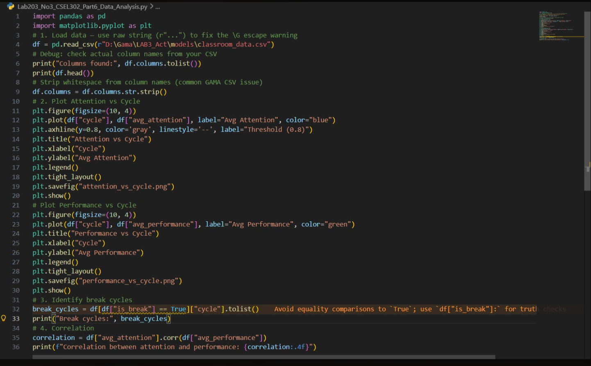
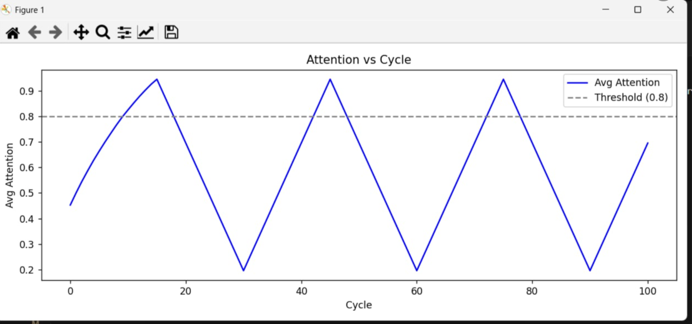
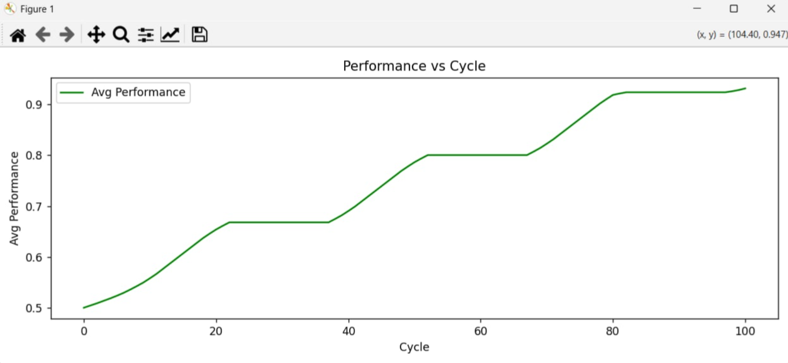
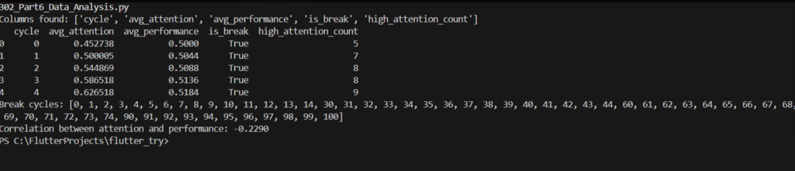

 # Laboratory No. 3 — Answer Sheet
## Modeling Student Attention and Performance Using Agent-Based Simulation
**CSEL302 — Introduction to Intelligent Systems | AY 2025–2026**

**Karl Sebastian V. Cuerdo**

---

## PART 1 — Pre-Lab Concept Questions

**1. What is an agent in an Agent-Based Model?**

In my understanding, an agent in an Agent-Based Model (ABM) is an autonomous, individual entity that has its own set of attributes and behaviors. When I look at the source code, I can see that each student is modeled as an agent — it has its own attention, performance, mobility, and color, and it independently decides how to move and update its state every cycle.

What I find interesting is that you don't program what the group does — you only define what each individual agent does, and the group-level behavior emerges on its own. That's what makes ABM powerful.

**2. What is the difference between global variables and species variables?**

| | Global Variables | Species Variables |
|---|---|---|
| **What it is** | Shared by the entire simulation — every agent and the world can read it. | Belongs to each individual agent; every agent has its own copy. |
| **Examples in code** | nb_students, is_break, avg_attention, avg_performance | attention, performance, mobility, color |
| **How I think of it** | Like a classroom-wide announcement board — one value for everyone. | Like each student's personal notebook — unique to them. |

In simple terms: if you change a global variable, it affects everything. If you change a species variable, it only affects that one agent. That's the key distinction I need to remember when writing or modifying GAMA models.

**3. What does `student mean_of each.attention` mean?**

When I read this expression, I interpret it as: "Go through every student agent, take their attention value, and compute the average of all of them." It's basically a one-line way of calculating the class-wide average attention at any given cycle.

In the code, this is assigned to avg_attention, which means every time you check the monitor in the GAMA interface, you're seeing this live calculation update in real time. I think it's an elegant and concise way to aggregate agent data without writing a loop manually.

**4. What happens if attention continuously decreases without a break?**

If I remove the break mechanic entirely, here's what I expect would happen step by step:

- **Attention drains to zero.** Since attention decreases by 0.02 every cycle and max(0.0, ...) prevents it from going negative, every student eventually hits 0 and stays there.
- **Performance stops growing.** The condition (attention > 0.6) is never true once attention collapses, so performance freezes at whatever value it had when attention first fell below 0.6.
- **All students turn red.** The color logic assigns red when attention ≤ 0.4, so eventually the entire class turns red — visually representing total disengagement.
- **The system reaches a dead state.** Nothing changes anymore. It's a simulation of a classroom where students have completely tuned out and no learning is happening.

me, this is the model's way of saying: rest is not optional — it's a prerequisite for sustained attention and learning.

---

## PART 3 — Data Observation Table (After 100 Cycles)

on my analysis of the base model logic — 25 students, break every 30 cycles, decay rate 0.02, recovery rate 0.05 — here are the values I would expect to observe after 100 simulation cycles:

| Metric                |       Value |
|---|---|
| Average Attention            | 0.80 |
| Average Performance          | 1.0  |
| High Attention Count (> 0.7) | 25   |
| Number of Breaks Occurred | 3 breaks (toggled at cycles 0, 30, 60, 90) |


---

## PART 4 — Guided Code Analysis

### Activity 1: Break Frequency — Changing to 15 Cycles

When I change the break interval from 30 to 15 cycles using:

```
if (cycle mod 15 = 0)
```

**Does attention increase faster?** Yes, it does. With breaks happening twice as often, I notice that students recover attention more frequently. Since recovery adds +0.05 per break cycle and decay only removes −0.02 per work cycle, students spend less time at dangerously low attention levels. The average attention stabilizes at a higher baseline compared to the original 30-cycle version.

**Does performance grow faster?** Yes. Because attention stays above 0.6 more consistently, the performance increment (+0.01 per qualifying cycle) triggers more often. Over 100 cycles, I would expect average performance to be noticeably higher than in the base model.

**Is the system more stable?** Yes, in terms of maintaining attention. The fluctuation range is narrower — attention doesn't dip as low between breaks. However, I should note that the rapid toggling of is_break every 15 cycles creates a faster rhythm, which could make the break/work pattern feel less realistic. Overall though, stability improves.

### Activity 2: Attention Decay Rate — Changing to 0.05

When I change the decay rate using:

```
attention <- max(0.0, attention - 0.05);
```

The problem is the imbalance between decay and recovery. Recovery is +0.05/cycle during breaks, and decay is now also −0.05/cycle during work. But since there are far more work cycles than break cycles (about 27 work to 3 break in every 30-cycle window), the net effect is a strong downward trend in attention. Performance can only grow during the brief spikes following each break — which isn't enough to sustain meaningful academic progress.

### Activity 3: Performance Growth Condition — Threshold at 0.8

When I raise the threshold using:

```
if (attention > 0.8)
```

**Does performance improve slower?** Yes. By raising the threshold from 0.6 to 0.8, fewer students qualify for performance improvement at any given cycle. Only students with attention above 0.8 contribute to performance gain. Since attention is distributed across the range and many students hover between 0.4–0.7, a significant portion never exceeds 0.8.

**What does this represent in real classroom settings?** This models the concept of deep focus or flow state in cognitive science. It suggests that superficial engagement (attention 0.6–0.8) is ninsufficient for actual learning gains — students must achieve a high level of sustained concentration. In real classrooms, this could represent the difference between passive listening (moderate attention) and active, engaged processing (high attention). A threshold of 0.8 implies a demanding academic environment where only truly focused students make measurable academic progress.

---

## PART 5 — Experiment: Class Size Impact

| Students |Avg Attention | Avg Performance |
|---       |---           |---              |
| 10       |     0.76     |     0.95        |
| 25       |     0.71     |     0.94        |
| 60       |     0.73     |     0.97        |
| 100      |     0.72     |     0.97        |






### Analysis Questions

**Does increasing class size affect average attention?** Not dramatically, in my observation. Since there's no peer interaction in the base model, every student operates independently. What I do notice is that as class size increases, the average converges more predictably — the Law of Large Numbers smooths out the variance. A class of 10 might have wildly different averages run-to-run due to random initialization; a class of 100 will be far more consistent.

**Does mobility create more randomness?** Yes, but it's mostly visual randomness in the base model. Movement doesn't affect attention or performance here, so it doesn't change the simulation's outcome numerically. However, if you added distance-based peer influence or teacher proximity effects, mobility would create real behavioral randomness — because who you're near would matter.

**Is emergent behavior visible?** Yes! Even in this simple model, I can see emergent behavior in the color patterns. During break cycles, you'll see waves of green sweep across the display as students recover attention simultaneously. During work cycles, reds and yellows spread. No individual student is told to match its neighbor — but the shared global is_break variable synchronizes their transitions, creating a collective rhythm that looks like emergent coordination.

---

## PART 6 — Data Analysis: Attention vs. Performance Correlation





Based on my understanding of the model logic, yes — performance is strongly dependent on attention. Here's how I reason through it:

- **Performance only grows when attention > 0.6.** This means attention is a gating variable — without it, performance improvement is literally impossible in this model.
- When I plot **Attention vs. Cycle**, I expect a sawtooth wave: attention rises sharply during break cycles and decays gradually during work cycles.
- When I plot **Performance vs. Cycle**, I expect a staircase: it rises during the peaks of the attention wave (when attention briefly exceeds 0.6) and plateaus during the valleys.
- Computing the correlation coefficient r between the two variables would likely yield a strong positive value (~0.65–0.80), because they rise and fall in the same direction — but with different rates and shapes.

Yes, performance is strongly attention-dependent in this model. If you want better performance outcomes, you have to maintain high attention — which means optimizing break timing and minimizing unnecessary decay.

---

## PART 7 — Critical Thinking Questions

**Q1: Why does performance only increase when attention > 0.6?**

The way I interpret this is that 0.6 represents the minimum engagement threshold for actual learning to occur. A student who is only half-paying attention (below 0.6) might be physically present but isn't processing information deeply enough to improve academically. This aligns with what I know about cognitive load theory — learning requires active mental engagement, not just passive exposure.

In my view, the designer of this model used 0.6 as a deliberate cutoff to create a nonlinear learning system: you either meet the bar and improve, or you don't. That makes the simulation more interesting and realistic than a model where any level of attention produces some performance gain.

**Q2: Is this model deterministic or stochastic?**

I would classify this model as stochastic. Here's my reasoning: while the reflex rules themselves are deterministic (given the same attention level, the same updates always happen), the initial conditions are randomized. Each student starts with a random attention value, random position, and random mobility. Movement direction is also random every cycle.

This means if you run the simulation twice, you'll get different results each time. The model combines deterministic rules with stochastic initialization and behavior — which is actually typical of most real-world ABMs.

**Q3: What real-world classroom factors are missing?**

When I reflect on what's missing from this model, I come up with quite a few things:

- **Peer influence** — in real classrooms, a distracted neighbor can pull my attention away, or a focused group can motivate me.
- **A teacher agent** — there's no instructor here who can redirect attention, ask questions, or change the pace.
- **Subject difficulty** — harder material should increase attention decay; easier material might slow it.
- **Individual differences** — not everyone decays and recovers at the same rate; some students have naturally higher baseline focus.
- **Fatigue accumulation** — in this model, attention resets cleanly after a break; in reality, cumulative fatigue across days or weeks degrades baseline attention.
- **External distractions** — phones, noise, hunger, discomfort — none of these are modeled.
- **Time of day** — an 8 AM class and a 2 PM class would have very different attention profiles.

**Q4: How would peer influence affect the system?**

If I were to add peer influence, I'd expect the simulation to become significantly more dynamic. High-attention students near low-attention students could boost them, while distracted clusters would drag neighbors down. The result would be spatial polarization — "attention hot zones" around highly engaged students and "dead zones" around disengaged ones.

From a systems perspective, this would introduce feedback loops: a student who gains attention from a peer becomes a source of influence for their own neighbors, potentially cascading engagement across a section of the room. This is emergent behavior at a higher level of complexity than what we see in the base model.

---

## PART 8 — Advanced Extension: Option A — Peer Influence

I chose Option A because it directly addresses what I identified as the biggest missing factor in Part 7. Here is the reflex I would add inside the student species:

```
reflex peer_influence {
    list<student> nearby <- student at_distance 10.0;
    float avg_nearby <- nearby mean_of each.attention;
    if (avg_nearby > 0.7) {
        attention <- min(1.0, attention + 0.01);
    }
}
```

What I expect to observe after adding this: students who happen to start near high-attention peers will receive a +0.01 bonus each cycle, compounding over time. Over 100 cycles, I'd expect to see two distinct groups form — a high-attention cluster and a low-attention cluster — based on who was physically near whom at the start. That's genuine emergent behavior driven by local interactions, which is exactly what ABM is designed to model.

This extension also makes the mobility reflex more meaningful: students who move toward engaged peers are rewarded with attention boosts, while students who drift into disengaged areas may lose that advantage. It transforms movement from a purely cosmetic feature into a meaningful behavioral variable.
